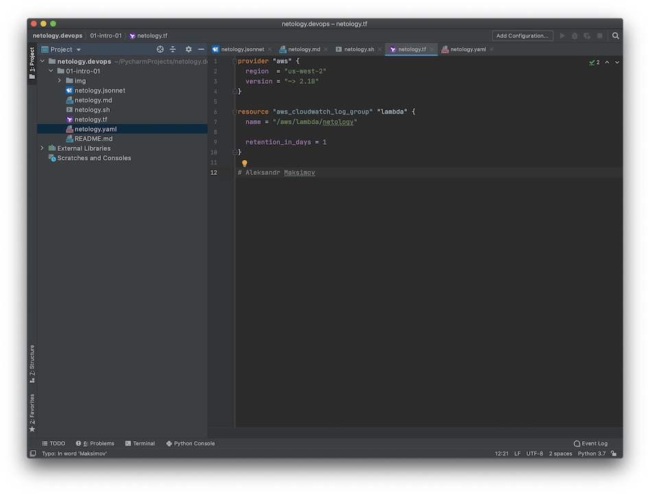
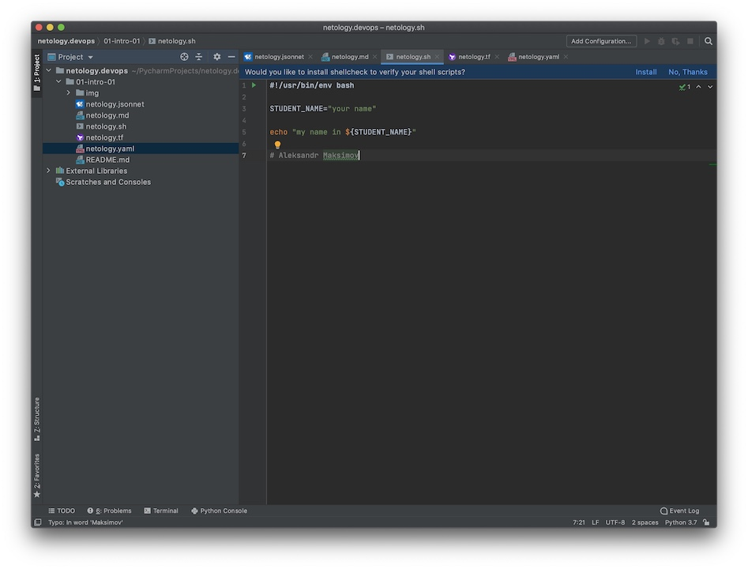
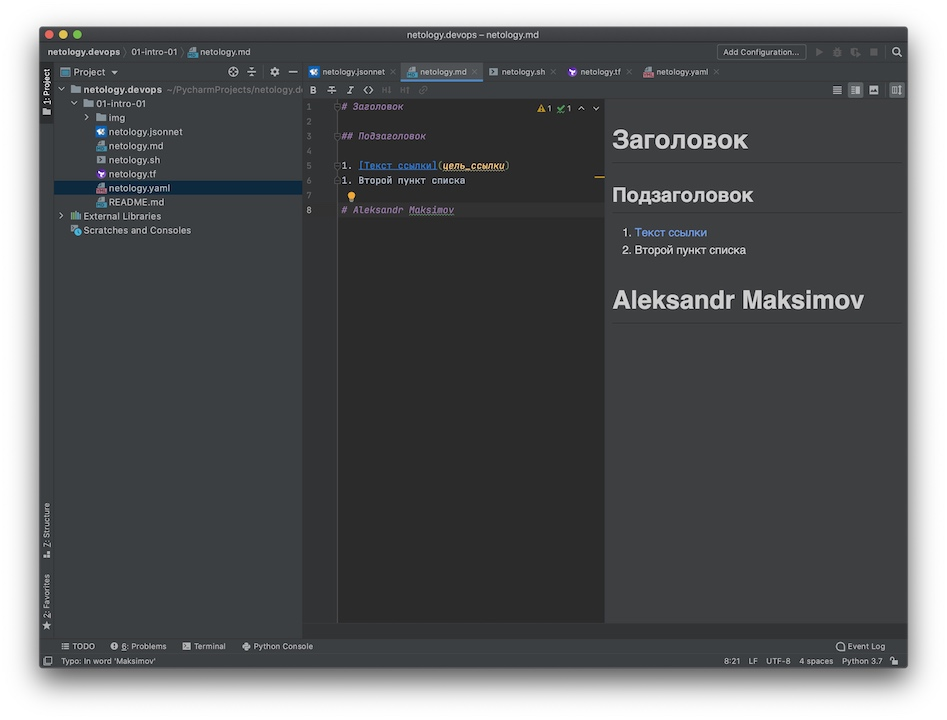
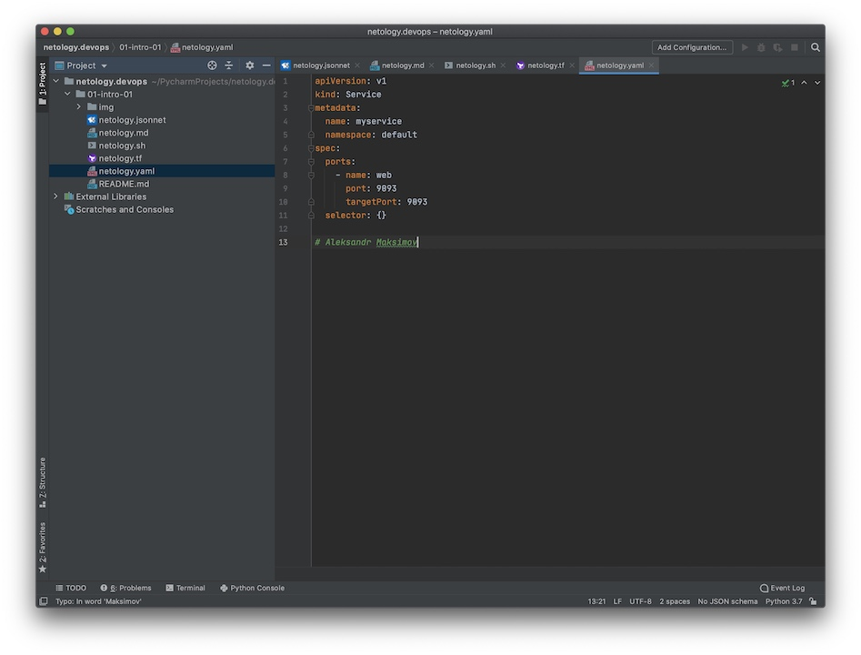
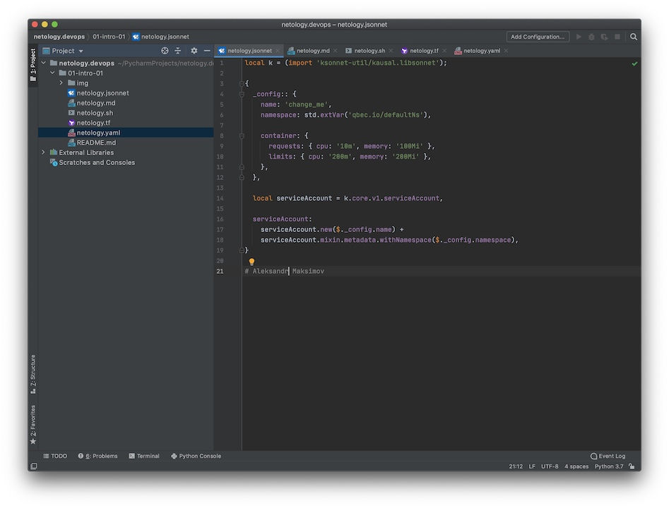

# Задание №1

Подсветка синтаксиса

- Terraform: 
- Bash: 
- Markdown: 
- Yaml: 
- Jsonnet: 

# Задание №2

1) Менеджер получает задачу от клиента и формулирует ее для разработчиков.
2) Разработчики пишут код и по окончании DevOps иженер выкатывает его на тестовый стенд.
3) Тестировщик обкатывает новый код на тестовом стенде и при выявлении недочетов и или ошибок, возвращает отчет разработчикам
4) Разработчики устраняют недочеты и DevOps иженер снова выкатывает код на тестовый стенд.
5) Повторяем пп 3, ели ошибок не обнаружено, менеджер демонстрирует новую версию продукта заказчику
6) Если заказчика все устраивает, DevOps иженер разворачивает код в продуктовой среде, иначе идем в пп1
7) Если при выкатке в прод. обнаружены ошибки, DevOps иженер откатывает изменения к предыдущему релизу.
8) Далее DevOps иженер разбирается в чем проблема и при необходимости привлекает к выявлению ошибки разработчиков или системных инженеров.
9) После устранения проблемы снова выкатываем в прод.

Ку!
