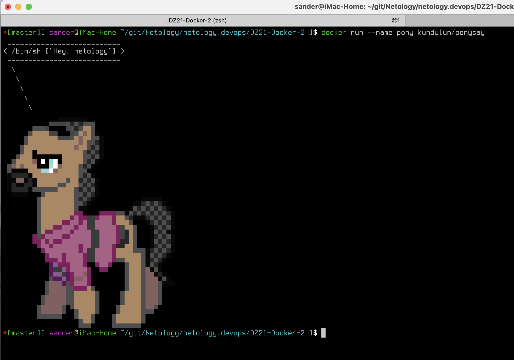
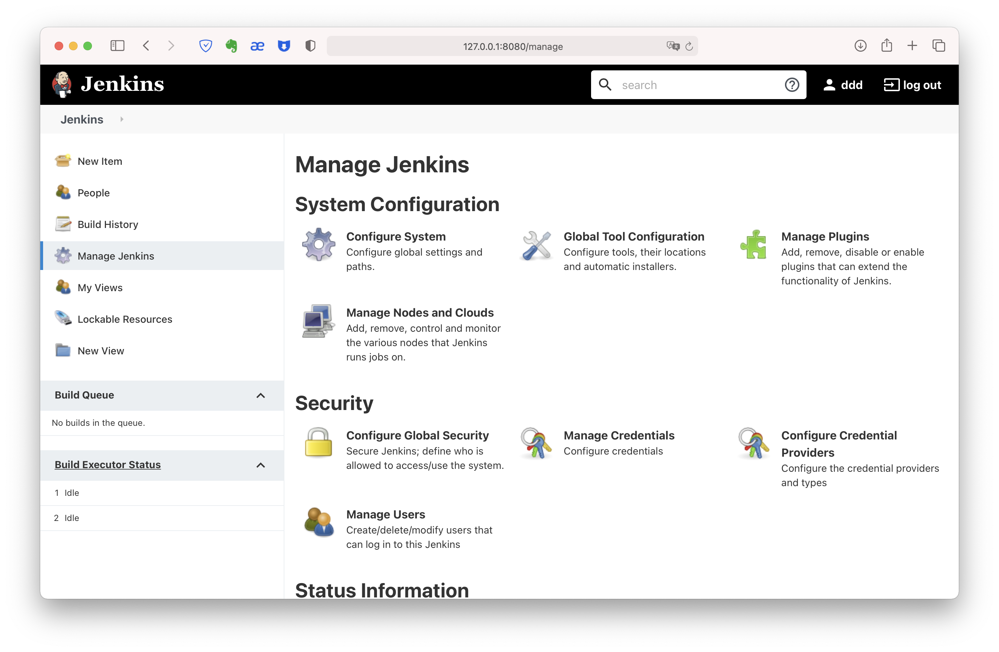

#### Домашняя работа к занятию "5.3. Контейнеризация на примере Docker"

* Задача 1

Измените базовый образ предложенного Dockerfile

```
FROM debian

ADD http://www.vcheng.org/ponysay/ponysay_3.0.2-1_all.deb /tmp
RUN apt-get update && apt-get install -y python3 && dpkg -i /tmp/ponysay_3.0.2-1_all.deb

ENTRYPOINT ["/usr/bin/ponysay"]
CMD ["Hey, netology”]
```


https://hub.docker.com/repository/docker/kundulun/ponysay

* Задача 2

```
FROM centos:7

ADD https://pkg.jenkins.io/redhat-stable/jenkins.repo /etc/yum.repos.d/jenkins.repo
RUN rpm --import https://pkg.jenkins.io/redhat-stable/jenkins.io.key && yum install java-11-openjdk jenkins -y
EXPOSE 8080 50000
CMD ["/usr/bin/java","-jar","/usr/lib/jenkins/jenkins.war"]
```
https://hub.docker.com/repository/docker/kundulun/cj
```
FROM ubuntu:18.04

ADD https://pkg.jenkins.io/debian-stable/jenkins.io.key /tmp
RUN apt-get update && apt-get install gnupg2 ca-certificates openjdk-8-jre -y
RUN apt-key add /tmp/jenkins.io.key
RUN echo "deb https://pkg.jenkins.io/debian-stable binary/" > /etc/apt/sources.list
WORKDIR /tmp
RUN apt-get update && apt-get download jenkins
RUN dpkg -i --force-all jenkins_2.249.3_all.deb
EXPOSE 8080 50000
CMD ["/usr/bin/java","-jar","/usr/share/jenkins/jenkins.war"]
```
https://hub.docker.com/repository/docker/kundulun/uj



* Задача 3
  
```
FROM node

WORKDIR /srv
RUN git clone https://github.com/simplicitesoftware/nodejs-demo
WORKDIR /srv/nodejs-demo
RUN npm install
EXPOSE 3000
ENV VCAP_APP_HOST="0.0.0.0"
CMD ["npm", "start"]
```
```
[ sander@iMac-Home ~ ]$ docker network inspect net1
[
    {
        "Name": "net1",
        "Id": "bf605e76b5d774f53def2a840396ee76e2eec12168fe96ed253ed2dfc276dcbe",
        "Created": "2020-11-07T18:10:27.444049463Z",
        "Scope": "local",
        "Driver": "bridge",
        "EnableIPv6": false,
        "IPAM": {
            "Driver": "default",
            "Options": {},
            "Config": [
                {
                    "Subnet": "172.18.0.0/16",
                    "Gateway": "172.18.0.1"
                }
            ]
        },
        "Internal": false,
        "Attachable": false,
        "Ingress": false,
        "ConfigFrom": {
            "Network": ""
        },
        "ConfigOnly": false,
        "Containers": {
            "3ec6e92d503e10975dc7c97f85e4f3d07ae4d624f3c856d40cfe913dc58791cd": {
                "Name": "nd1",
                "EndpointID": "ebf2906b467002480b779d6325ad3ef3c759033165550d309d1c4e3bb2aba41e",
                "MacAddress": "02:42:ac:12:00:02",
                "IPv4Address": "172.18.0.2/16",
                "IPv6Address": ""
            },
            "406021f15c975af133b8d26add22f5ec3b8f2ce1a7fdf406edf08ab31be4357f": {
                "Name": "ub",
                "EndpointID": "398c9992b187c6e10853f734daa669c5f9ac9f4dc8e1d1837e068765e646f9d2",
                "MacAddress": "02:42:ac:12:00:03",
                "IPv4Address": "172.18.0.3/16",
                "IPv6Address": ""
            }
        },
        "Options": {},
        "Labels": {}
    }
]
```
```
root@406021f15c97:/# curl -sSL -D -  http://172.18.0.2:3000 -o /dev/null
HTTP/1.1 200 OK
X-Powered-By: Express
Cache-Control: private, no-cache, no-store, no-transform, must-revalidate
Expires: -1
Pragma: no-cache
Content-Type: text/html; charset=utf-8
Content-Length: 524711
ETag: W/"801a7-PVcmLHh9UHPFklABZyrP3Ze9Q68"
Date: Mon, 09 Nov 2020 08:23:42 GMT
Connection: keep-alive
```